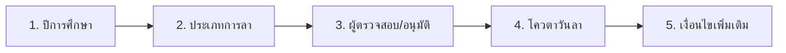
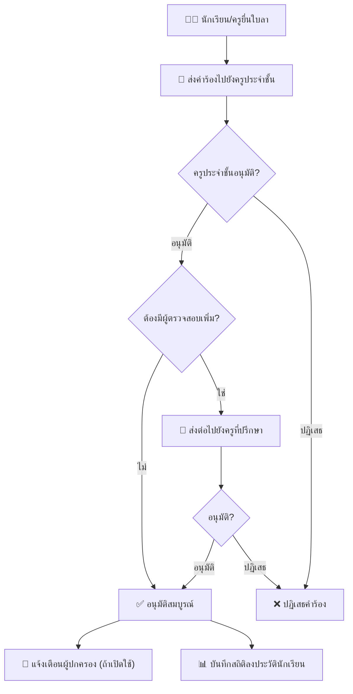

# แผนออกแบบ: หน้าตั้งค่าการลาเรียนของนักเรียน

## บริบทและเป้าหมาย

สร้างหน้า **"ตั้งค่าการลาเรียน"** ใน [leave-features.html](file:///d:/work/SchoolDark/uxui/leave-features.html) สำหรับกำหนดค่าระบบ **การลาเรียนของนักเรียน** (ลาป่วย, ลากิจ ฯลฯ) ซึ่ง**แยกออกจากระบบบัตรขออนุญาต**ที่มีอยู่แล้ว

> [!NOTE]
> **ความแตกต่างของ 2 ระบบ:**
> - **บัตรขออนุญาต** (มีอยู่แล้ว) = ขออนุญาตเข้า/ออกห้องเรียนหรือออกนอกโรงเรียน **ระหว่างวัน**
> - **การลาเรียน** (จะสร้างใหม่) = นักเรียน **ลาหายไปจากโรงเรียน** เป็นวัน ๆ (ลาป่วย, ลากิจ ฯลฯ) คล้ายระบบการลาของบุคลากรใน [app.html](file:///d:/work/SchoolDark/uxui/app.html)

รูปแบบ UI ใช้ **Journey Steps** (แบบขั้นตอนแนวนอน) เดียวกับหน้าตั้งค่าการลาบุคลากรใน [app.html L583-911](file:///d:/work/SchoolDark/uxui/app.html#L583-L911) ที่มี 2 คอลัมน์ (ฟอร์มซ้าย + Live Preview ขวา)

---

## โครงสร้าง Journey Steps (5 ขั้นตอน)

---

### ขั้นตอนที่ 1: ตั้งค่าปีการศึกษา 📅

| ฟอร์ม (ซ้าย) | Live Preview (ขวา) |
|---|---|
| Dropdown เลือกปีการศึกษา เช่น `2569` | แสดง timeline ของปีการศึกษา |
| วันที่เปิดภาคเรียนที่ 1 (date input) | เช่น "ภาคเรียนที่ 1: 16 พ.ค. - 10 ต.ค. 2569" |
| วันที่ปิดภาคเรียนที่ 1 (date input) | "ภาคเรียนที่ 2: 1 พ.ย. 2569 - 31 มี.ค. 2570" |
| วันที่เปิดภาคเรียนที่ 2 (date input) | + จำนวนวันเรียนรวมทั้งปี |
| วันที่ปิดภาคเรียนที่ 2 (date input) | |

> [!NOTE]
> ระบบการลาของบุคลากรใช้ "วันตัดรอบปีทำงาน" แต่สำหรับนักเรียนเปลี่ยนเป็น **"ปีการศึกษา"** (เทอม 1 + เทอม 2) เพื่อใช้คำนวณโควตาวันลาและรีเซ็ตยอดสะสมเมื่อขึ้นปีการศึกษาใหม่

---

### ขั้นตอนที่ 2: จัดการประเภทการลา (CRUD) 📋

| ฟอร์ม (ซ้าย) | Live Preview (ขวา) |
|---|---|
| ตารางรายการประเภทการลาที่มีอยู่ | แสดง Preview ตัวอย่างฟอร์มยื่นคำขอลาที่นักเรียนจะเห็น |
| แต่ละแถว: ชื่อประเภท, คำอธิบาย, สี, ปุ่ม แก้ไข/ลบ | โดยแสดง dropdown ประเภทลา + รายละเอียดทั้งหมด |
| ปุ่ม **"+ เพิ่มประเภทใหม่"** เปิดฟอร์มย่อย | อัปเดตตามข้อมูลที่เพิ่ม/ลบแบบ real-time |

**ฟิลด์เพิ่ม/แก้ไขประเภท:**
- `ชื่อประเภทลา` — text input (เช่น "ลาป่วย")
- `คำอธิบายสั้น` — text input (เช่น "ลาเนื่องจากเจ็บป่วย")
- `สี Badge` — dropdown preset สี (เช่น แดง, ส้ม, เขียว)
- `ต้องแนบใบรับรองแพทย์?` — toggle switch (สำหรับลาป่วยเกิน X วัน)

**ประเภทเริ่มต้น (Default):**

| # | ชื่อประเภท | คำอธิบาย | สี |
|---|---|---|---|
| 1 | ลาป่วย | ลาเนื่องจากเจ็บป่วย | 🔴 แดง |
| 2 | ลากิจ | ลาเนื่องจากธุระส่วนตัว/ครอบครัว | 🟠 ส้ม |
| 3 | ลาอื่น ๆ | ประเภทลาอื่น ๆ ที่ไม่ระบุ | 🔵 น้ำเงิน |

> [!IMPORTANT]
> **คำถาม:** ต้องการประเภทลาเริ่มต้นอะไรบ้าง? ตัวอย่างข้างบนเป็น 3 ประเภทพื้นฐาน ถ้าต้องการเพิ่ม เช่น "ลาบวช", "ลาไปแข่งขัน/ทัศนศึกษา" แจ้งได้ครับ

---

### ขั้นตอนที่ 3: กำหนดผู้ตรวจสอบ/อนุมัติ ✅

| ฟอร์ม (ซ้าย) | Live Preview (ขวา) |
|---|---|
| **จำนวนผู้ตรวจสอบขั้นต่ำ** — number input | แสดง Flow Chart ลำดับการอนุมัติ |
| เช่น `ต้องมีผู้ตรวจสอบอย่างน้อย ___ คน` | เช่น: นักเรียนยื่น → ครูประจำชั้น → ครูที่ปรึกษา → อนุมัติ |
| **ระบุบทบาทผู้ตรวจสอบ (checkbox):** | |
| ✅ ครูประจำชั้น (ดึงอัตโนมัติจากข้อมูลห้องเรียน) | Badge: "ดึงข้อมูลอัตโนมัติจากระบบ" |
| ✅ ครูที่ปรึกษา (ดึงอัตโนมัติจากข้อมูลห้องเรียน) | Badge: "ดึงข้อมูลอัตโนมัติจากระบบ" |
| ☐ หัวหน้าระดับชั้น (เลือกจาก dropdown) | |
| ☐ ฝ่ายปกครอง (เลือกจาก dropdown) | |
| **Toggle: ต้องอนุมัติตามลำดับ?** | ถ้าเปิด = ทีละคนตามลำดับ |
| | ถ้าปิด = ใครอนุมัติก่อนก็ได้ |

**วิธีดึงข้อมูลครูประจำชั้น/ครูที่ปรึกษา:**
- ระบบจะอ้างอิงจากข้อมูลห้องเรียนที่ตั้งไว้ (เช่น ม.3/1 → ครูประจำชั้น = ครู ก.)
- ผู้ดูแลไม่ต้องเลือกรายชื่อรายคน ระบบจะ **map อัตโนมัติ** ตอนนักเรียนยื่นคำขอ

> [!NOTE]
> **คำแนะนำ:** ควรมี fallback — ถ้าห้องเรียนนั้นยังไม่กำหนดครูประจำชั้น ให้ส่งคำร้องไปยัง **ฝ่ายปกครอง** โดยอัตโนมัติ

---

### ขั้นตอนที่ 4: กำหนดโควตาวันลา 🔢

| ฟอร์ม (ซ้าย) | Live Preview (ขวา) |
|---|---|
| **จำนวนครั้ง/วันลาสูงสุดต่อ 1 ปีการศึกษา** | แสดงตาราง Preview โควตา |
| แยกตามประเภทลา (ดึงจาก Step 2): | เช่น: |
| • ลาป่วย: [15] ครั้ง/ปี | "ลาป่วย: 15 ครั้ง/ปี" |
| • ลากิจ: [10] ครั้ง/ปี | "ลากิจ: 10 ครั้ง/ปี" |
| • ลาอื่น ๆ: [5] ครั้ง/ปี | "ลาอื่น ๆ: 5 ครั้ง/ปี" |
| **Toggle: "ไม่จำกัด" ต่อประเภท** | ถ้าเปิด = ไม่มีเพดาน |
| **Toggle: จำกัดจำนวนครั้งต่อเดือน?** | ถ้าเปิด = เพิ่มฟิลด์โควตา/เดือน |

> [!TIP]
> **คำแนะนำ:** ในโรงเรียนทั่วไป หากนักเรียนลาเกินจำนวนที่กำหนด (เช่น ลากิจเกิน 10 ครั้ง) ระบบควร **แจ้งเตือน** ครูประจำชั้นและฝ่ายปกครอง แต่ไม่ควร **บล็อก** การลา เพราะนักเรียนอาจมีเหตุจำเป็นจริง

---

### ขั้นตอนที่ 5: เงื่อนไขเพิ่มเติม ⚙️

| ฟอร์ม (ซ้าย) | Live Preview (ขวา) |
|---|---|
| **Toggle: บังคับแนบใบรับรองแพทย์ เมื่อลาป่วยเกิน ___ วัน** | แสดงตัวอย่างฟอร์มลาที่จะแสดงผล |
| (number input สำหรับจำนวนวัน เช่น 3 วัน) | + ส่วนที่เปิด-ปิดตามการ Toggle |
| **Toggle: แจ้งเตือนผู้ปกครองอัตโนมัติ** (LINE/SMS) | |
| **Toggle: อนุญาตให้นักเรียนยื่นคำขอลาเอง** | (หรือต้องให้ครูกรอกให้เท่านั้น) |
| **จำนวนครั้งที่เตือนก่อนถึงโควตา** | เช่น "เตือนเมื่อเหลือ 3 ครั้ง" |

> [!TIP]
> **คำแนะนำ:** "แจ้งเตือนผู้ปกครองอัตโนมัติ" เป็นฟีเจอร์ที่มีคุณค่ามากในระบบโรงเรียน ช่วยให้ผู้ปกครองทราบทันทีว่าลูกลาเรียน ลดปัญหาการโดดเรียนโดยผู้ปกครองไม่รู้

---

## Flow การอนุมัติการลาที่แนะนำ

---

## สิ่งที่จะเปลี่ยนแปลงในโค้ด

### [MODIFY] [leave-features.html](file:///d:/work/SchoolDark/uxui/leave-features.html)

#### 1. Sidebar Menu
- เพิ่มเมนู **"ตั้งค่าการลาเรียน"** ใต้เมนู "รายชื่อบุคลากรและอาจารย์" พร้อม icon ⚙️
- เพิ่ม divider และ label "การลาเรียนนักเรียน" เพื่อแยก section ให้ชัดเจน

#### 2. HTML Section ใหม่
- เพิ่ม `
` ที่มี:
  - Journey Steps (5 ขั้นตอน) — ใช้ CSS class เดียวกับ `app.html` (`.journey-steps`, `.journey-step`, `.step-node`, `.step-label`)
  - Settings Step Grid 2 คอลัมน์ (`.settings-step-grid`) — ฟอร์มซ้าย + Preview ขวา เหมือน `app.html`
  - Wizard Buttons (ย้อนกลับ / ถัดไป / บันทึก)

#### 3. JavaScript
- เพิ่มตัวแปร `STUDENT_LEAVE_TYPES` array สำหรับเก็บประเภทลา (CRUD)
- เพิ่มฟังก์ชัน `addStudentLeaveType()`, `removeStudentLeaveType()`, `renderStudentLeaveTypes()`
- เพิ่มฟังก์ชัน navigation ระหว่าง step + Live Preview ทุก step

---

## Open Questions

> [!IMPORTANT]
> **คำถาม 1:** ประเภทลาเริ่มต้น ลาป่วย / ลากิจ / ลาอื่น ๆ — พอไหม? หรือต้องการเพิ่มเช่น "ลาไปแข่งขัน/กิจกรรม", "ลาบวช" เป็นต้น?

> [!IMPORTANT]
> **คำถาม 2:** ข้อมูลครูประจำชั้น/ครูที่ปรึกษาของแต่ละห้อง ตอนนี้มีเก็บอยู่ที่ไหนในระบบแล้วหรือยัง? ถ้ายังจะใช้ข้อมูล mock ไปก่อน

> [!IMPORTANT]
> **คำถาม 3:** ขั้นตอน "ปีการศึกษา" (Step 1) — จำเป็นต้องมีในหน้านี้ไหม? หรือดึงจากการตั้งค่าส่วนกลางแทน (ถ้ามี)?

---

## Verification Plan

### Manual Verification
- เปิด leave-features.html → คลิกเมนู "ตั้งค่าการลาเรียน" → ตรวจสอบ Journey Steps ทั้ง 5 ขั้นตอน
- ทดสอบ CRUD ประเภทการลา (เพิ่ม/แก้/ลบ)
- ตรวจสอบว่า Live Preview ทุก step อัปเดตตามค่าที่กรอก
- ตรวจสอบว่าดีไซน์สอดคล้องกับหน้าตั้งค่าการลาบุคลากรใน app.html
